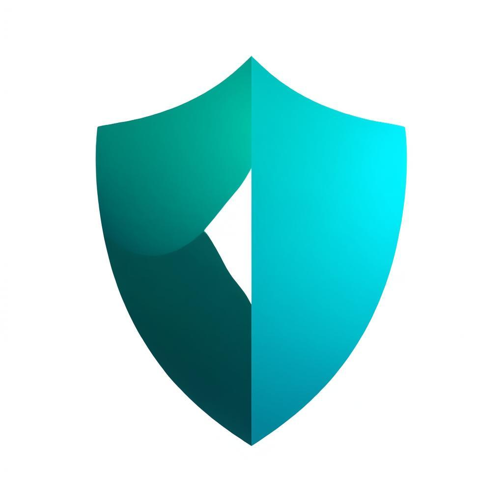

# 🛡️ VeeShield - AI-Powered Security Suite for Windows 11

<div align="center">
  
  
  **Next-generation AI-powered antivirus with voice assistant "Hey Vee"**
  
  [](https://opensource.org/licenses/MIT)
  [](https://www.typescriptlang.org/)
  [](https://nextjs.org/)
  [](https://react.dev/)
  [](https://www.electronjs.org/)
  [](https://tailwindcss.com/)
</div>

---

## ✨ Features

### 🔍 **Multi-Layer Malware Detection**
- **YARA Rules Engine** - Pattern-based threat detection with 15+ customizable rules
- **Signature-Based Detection** - Hash matching against known malware database
- **Heuristic Analysis** - Behavior-based detection for zero-day threats
- **Real-time Protection** - Continuous monitoring of file system activities

### 🧹 **Auto-Deep Clean**
- **Temporary Files Cleanup** - Remove user and system temp files
- **Browser Cache Cleaning** - Clear cache from Chrome, Edge, Firefox
- **Log File Management** - Clean old Windows logs and error reports
- **Windows Update Cache** - Remove old update files safely
- **Deep Clean Mode** - Advanced cleanup for power users

### 🎤 **AI Voice Assistant "Hey Vee"**
- **Wake Word Detection** - Say "Hey Vee" to activate
- **Natural Language Commands** - Speak naturally to control the app
- **Voice Responses** - Get spoken feedback from Vee
- **Quick Actions** - Scan, clean, and check status hands-free

### 📊 **Modern Dashboard**
- **Real-time Status** - Monitor protection status at a glance
- **Threat Vault** - Manage quarantined files
- **Scan History** - Review past scans and detections
- **Protection Score** - Visual security posture indicator

---

## 🚀 Tech Stack

| Technology | Version | Purpose |
|------------|---------|---------|
| **Next.js** | 16.2.1 | Full-stack React framework |
| **React** | 19.2.4 | UI library |
| **TypeScript** | 5.9.3 | Type safety |
| **Tailwind CSS** | 4.2.2 | Styling |
| **shadcn/ui** | Latest | UI components |
| **Prisma** | 7.5.0 | Database ORM |
| **Electron** | 41.0.3 | Desktop wrapper |
| **Framer Motion** | 12.38.0 | Animations |
| **Recharts** | 2.15.4 | Charts & graphs |
| **Lucide** | 0.577.0 | Icons |
| **Zustand** | 5.0.12 | State management |
| **TanStack Query** | 5.95.0 | Server state |

---

## 📦 Installation

### Prerequisites
- **Node.js** 18.x or later ([Download](https://nodejs.org/))
- **npm** (comes with Node.js)
- **Windows 11** (for desktop app)

### Quick Start

```bash
# Clone the repository
git clone https://github.com/waleedmandour/veeshield.git
cd veeshield

# Install dependencies
npm install

# Run development server
npm run dev
```

Open [http://localhost:3000](http://localhost:3000) in your browser.

---

## 🖥️ Build Desktop App

```bash
# Install Electron dependencies
npm install

# Run as desktop app (development)
npm run electron:dev

# Build Windows installer (.exe)
npm run electron:build
```

The installer will be in the `dist/` folder.

---

## 📁 Project Structure

```
veeshield/
├── src/
│   ├── app/                    # Next.js App Router
│   │   ├── api/               # Backend API routes
│   │   │   ├── scan/          # Malware scanning API
│   │   │   ├── clean/         # System cleaning API
│   │   │   └── assistant/     # AI assistant API
│   │   ├── layout.tsx         # Root layout
│   │   └── page.tsx           # Main dashboard
│   ├── components/
│   │   ├── ui/                # shadcn/ui components
│   │   └── veeshield/         # VeeShield components
│   │       ├── VeeshieldDashboard.tsx
│   │       ├── VoiceAssistant.tsx
│   │       ├── ScanPanel.tsx
│   │       ├── CleanPanel.tsx
│   │       ├── ThreatList.tsx
│   │       └── StatusCards.tsx
│   └── lib/
│       ├── antivirus/         # Antivirus engine
│       │   ├── scanner.ts     # Core scanner
│       │   └── signatures.ts  # Malware signatures
│       ├── cleaner/           # System cleaner
│       └── assistant/         # AI voice assistant
├── electron/                   # Electron desktop wrapper
│   ├── main.js                # Main process
│   └── preload.js             # Preload script
├── data/
│   └── yara-rules/            # YARA detection rules
├── prisma/                    # Database schema
└── public/                    # Static assets
```

---

## 🎤 Voice Commands

Say **"Hey Vee"** followed by any command:

| Command | Action |
|---------|--------|
| `"scan my computer"` | Start a quick scan |
| `"run a full scan"` | Start a full system scan |
| `"clean my computer"` | Clean temporary files |
| `"what is the status"` | Check protection status |
| `"any threats"` | Show detected threats |
| `"show history"` | View scan history |
| `"open settings"` | Open settings panel |
| `"help"` | Show available commands |

---

## 🔒 Security Features

### Detection Engines

1. **YARA Rules Engine**
   - Ransomware detection (LockBit, WannaCry, Ryuk)
   - Trojan detection (Emotet, TrickBot, QakBot)
   - Spyware detection (FinFisher, Pegasus)
   - Rootkit indicators

2. **Signature Database**
   - MD5/SHA256 hash matching
   - 20+ known malware families
   - Regular definition updates

3. **Heuristic Analysis**
   - Suspicious file extensions
   - Double extension detection
   - Embedded macro detection
   - Process injection patterns
   - Encoded PowerShell detection

---

## 🔧 API Reference

### Scan API

```typescript
// Start system scan
POST /api/scan
{
  "action": "start_system_scan",
  "scanType": "quick" | "full" | "custom"
}

// Scan single file
POST /api/scan
{
  "action": "scan_file",
  "fileName": "example.exe",
  "content": "base64-encoded-content"
}
```

### Clean API

```typescript
POST /api/clean
{
  "action": "start_clean",
  "options": {
    "targets": ["temp-user", "cache-thumbnail"],
    "deepClean": false
  }
}
```

### Assistant API

```typescript
POST /api/assistant
{
  "action": "process_voice",
  "transcript": "Hey Vee, scan my computer"
}
```

---

## 🚢 Deployment

### Vercel (Recommended)

[](https://vercel.com/new/clone?repository-url=https://github.com/waleedmandour/veeshield)

### Manual Deploy

1. Push code to GitHub
2. Go to [vercel.com](https://vercel.com)
3. Import your repository
4. Click "Deploy"

---

## 🤝 Contributing

Contributions are welcome! Please see [CONTRIBUTING.md](CONTRIBUTING.md) for details.

1. Fork the repository
2. Create your feature branch (`git checkout -b feature/amazing-feature`)
3. Commit your changes (`git commit -m 'Add amazing feature'`)
4. Push to the branch (`git push origin feature/amazing-feature`)
5. Open a Pull Request

---

## 📜 License

This project is licensed under the MIT License - see [LICENSE](LICENSE).

---

## 🙏 Acknowledgments

- [ClamAV](https://www.clamav.net/) - Open-source antivirus engine
- [YARA](https://virustotal.github.io/yara/) - Pattern matching for malware researchers
- [VirusTotal](https://www.virustotal.com/) - YARA rule development
- [shadcn/ui](https://ui.shadcn.com/) - Beautiful UI components
- [Next.js](https://nextjs.org/) - React framework

---

## 📞 Support

- **Issues**: [GitHub Issues](https://github.com/waleedmandour/veeshield/issues)
- **Discussions**: [GitHub Discussions](https://github.com/waleedmandour/veeshield/discussions)

---

<div align="center">
  <p>Made with ❤️ by <a href="https://github.com/waleedmandour">Waleed Mandour</a></p>
  <p>⭐ Star us on GitHub — it motivates us!</p>
</div>
